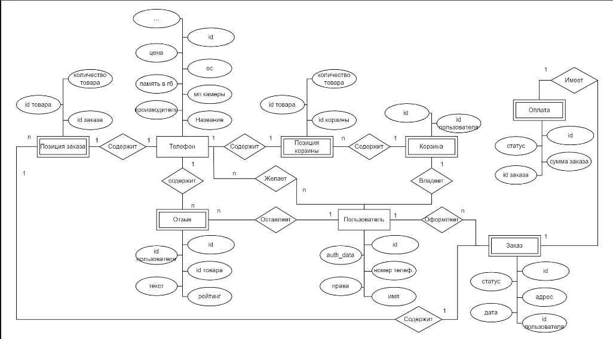
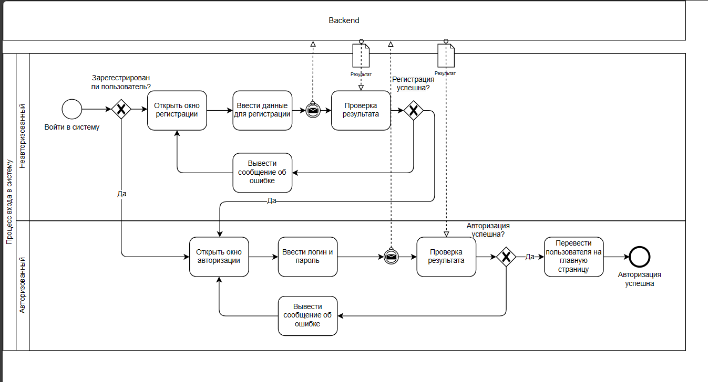
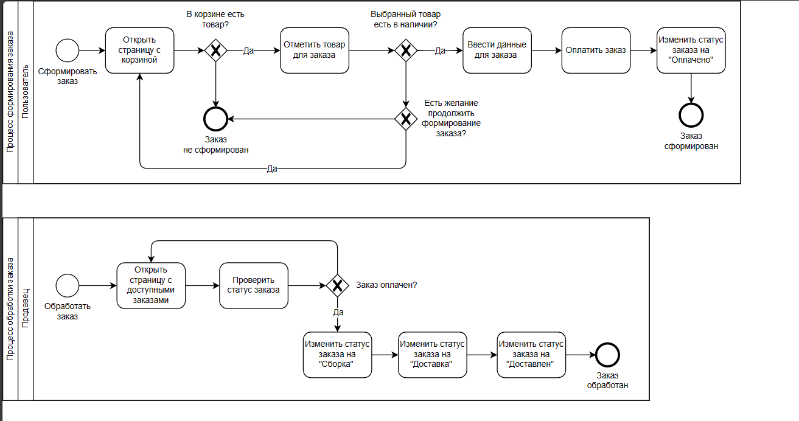
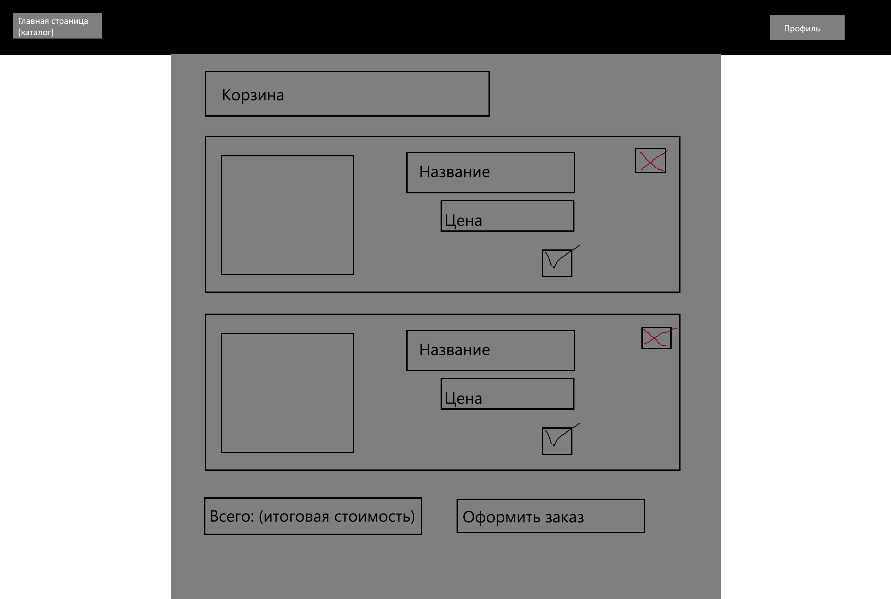

# Лабораторная работа 1

## Название

Онлайн магазин телефонов

## Краткое описание идеи проекта

Web-приложение для интернет магазина телефонов.
Посетитель сайта может просматривать ассортимент.
После регистрации и авторизации можно оформить заказ на добавленный в корзину товар.
Администратор может добавлять и удалять товары из каталога, а так же редактировать описание уже существующих.

## Краткое описание предметной области

Предментная область включает в себя следующие сущности:

1. Посетитель
2. Телефон
3. Корзина
4. Администратор
5. Продавец
6. Отзыв на товар

## Краткое описание акторов

1. Посетитель - может просматривать ассортимент
2. Пользователь (авторизованный посетитель) - может оформлять покупки, писать отзывы и оценивать отзывы других пользователей
3. Администратор - может добавлять товары, удалять товары и изменять их описание
4. Продавец - может изменять статус заказа (обрабатывает заказы)

## Краткий анализ аналогичных решений по 3-м критериям

|Сайт|Поиск с учетом названия и характеристик|Онлайн оплата|Система отзывов|
|-------------------|------------------|---------------|---------------------------|
|www.mvideo.ru|+|+|+|
|eldorado.ru|+|+|+|
|dns-shop.ru|+|+|+|
|мой проект|+|+|+|

## Краткое описание целесообразности и актуальности проекта

Актуальность проекта заключается в том, что использование web-приложений для онлайн торговли позволяет клиенту сразу же оценить ассортимент, цены
и совершить покупку с минимальным участием сотрудников.

Целесообразность заключается в том, что сервисы других магазинов являются закрытыми.
Таким образом, необходимо разработать собственное приложения, для возможности работы с базой данных магазина,
это приложение будет предоставлять удобный интерфейс для пользователя.

## Use-Case

## ER

## Пользовательские сценарии

Посетитель может зайти на сайт и:

1. Зайти на основную страницу
2. Искать товары по названию и тегам
3. Зайти на страницу товара, посмотреть характеристики и отзывы
4. Зайти на страницу регистрации, зарегестрироваться или перейти на страницу авторизации.
5. Зайти на страницу авторизации, авторизироваться или перейти на страницу регистрации.

Пользователь:
1. Зайти на основную страницу
2. Искать товары по названию и тегам
3. Добавить товар в корзину или удалить товар из корзины
4. Перейти к содержимому корзины
5. Зайти на страницу товара, посмотреть характеристики и отзывы
6. Оформить заказ на содержимое корзины
7. Оставить отзыв
8. Оценить отзыв
9. Выйти из аккаунта

Администратор:
1. Зайти на основную страницу
2. Искать товары по названию и тегам
3. Зайти на страницу товара, посмотреть характеристики и отзывы
4. Добавить товар
5. Удалить товар
6. Изменить характеристики товара
7. Выйти из аккаунта

## Формализация бизнес-правил, BPMN-диаграмма

## Тип приложения
Web SPA

## Технологический стек
- Backend: TypeScript (nodejs)
- Frontend: HTML + CSS + JS
- Database: PostgreSQL
  
## Верхнеуровневое разбиение на компоненты
Приложение будет состоять из 3 компонентов:
- компонент реализации UI
- Компонент реализации бизнес-логики (Business Logic)
- Компонент доступа к данным (Data Access)
  
  

## Диаграмма компонентов
  

## Диаграмма классов
  

## Черновые эскизы страниц

